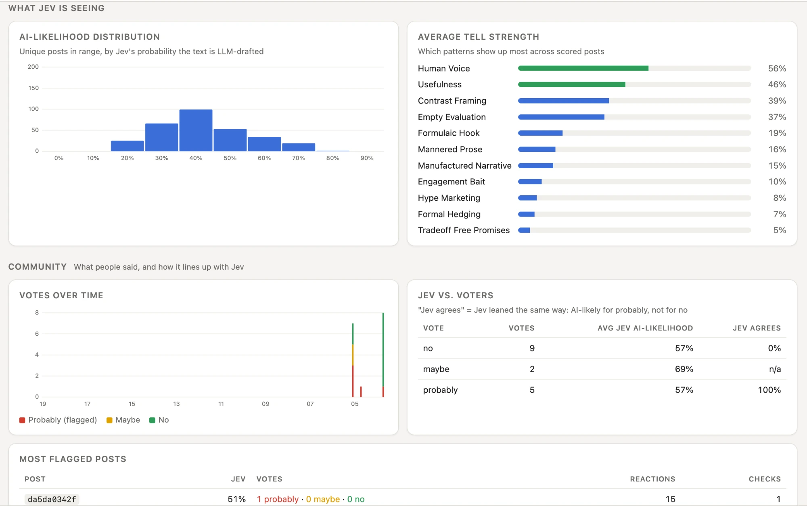

# Slop Mop

**Mop the slop out of your LinkedIn feed.**

[slopmop.lol](https://slopmop.lol)

*Not an AI detector. A bad-writing detector.* Your attention deserves a filter you control.

Free. No signup. MIT licensed. Desktop Chrome and other Chromium browsers, LinkedIn only for now.


Slop Mop is a small, slightly mischievous research experiment. A browser extension reads LinkedIn posts before they reach you, asks an AI model to judge the writing, and either folds the suspected slop into a strip or outlines it, along with the reasons. You can always open a post, inspect the score, or overrule the verdict. Slop Mop never deletes, reports, mutes or blocks anything.

Less slop. More control. Your call.

## At a glance

✅ Free. No signup, no account, no paid tier
✅ Reads posts before they reach you
✅ Hides suspected slop in a strip, or outlines it and says why
✅ Shows the score and the signs behind it
✅ Lets you overrule it: unfold a post, or vote No, Maybe or Probably
✅ Keeps useful writing, however it was made
✅ Open source (MIT): run your own server, change the weights

❌ Doesn't send author names, only the post text and its reaction, comment and repost counts
❌ Doesn't read your drafts unless you press the mop button in the post composer
❌ Doesn't send your name, LinkedIn account or anything about you (votes use a random install id)
❌ Doesn't store the post text (only a hash of it and the scores)
❌ Doesn't run outside LinkedIn or read your other tabs
❌ Doesn't touch ads
❌ Doesn't delete, report, mute or block anything
❌ Doesn't cost money
❌ Doesn't claim to know who wrote a post. It's not an AI detector

## Not an AI detector

The question isn't "did AI write this?" It's "was this worth someone's attention?"

Useful AI-assisted writing shouldn't lose because a model touched it. Human-written junk shouldn't get a free pass because a person typed it. So Slop Mop judges the writing. One of its questions does ask how likely a model drafted a post, but that answer can only nudge a score down for writing that reads as human-typed. It never flags a post by itself.

## How it works

For each post, the extension sends the text to a server, which asks **Jev**, a model from [Typesafe AI](https://typesafe.ai), twelve questions in parallel. Eleven are judgments of the writing:

- **Nine signs of slop**, taken from Graphite's [AI tells research](https://graphite.io/five-percent/research/ai-tells), which compared 10,000 human-written articles with 90,000 written by nine models and listed the patterns that turn up at least twice as often in AI text. Examples: defining things by contrast ("not X, but Y"), evaluative words with nothing behind them, hype vocabulary, a manufactured story with a tidy lesson, engagement bait.
- **Two counter-signs**: does it sound like one particular person, and is it useful to a reader?

The twelfth asks how likely a model drafted the post. It exists only to soften the score of writing that reads as human-typed.

Those become a score. Reactions, comments and reposts count too, because a post people really engaged with has earned some benefit of the doubt. Then you choose what to do with it:

- **Hide** collapses suspected slop into a compact strip you can reopen.
- **Highlight** leaves the post where it is, outlines it yellow (possibly slop) or red (likely slop), and explains why.
- **Mild, Moderate and Aggressive** set how much doubt it takes to act. Hide with Aggressive makes LinkedIn feel like a different place. Highlight with Mild is for the curious.

Every post gets a mop icon beside its "…" menu. Open it to see the score out of 100, the reasons (a spider chart of what Jev noticed) and to vote **No**, **Maybe** or **Probably** (slop). Your vote overrides the model for you. Anonymous votes also feed the research: over time they help tune how the signs are weighted.

| Hide mode | The admin console |
|---|---|
|  |  |

**Check a draft before you post it.** The post composer gets a mop button beside its toolbar. Press it and the same breakdown a posted post gets appears beside the composer. It scores what you've written so far, as your own writing, and uses one of the day's checks. Nothing is read until you press it.

Ads are never scored, hidden or outlined. LinkedIn already has a view on that, and I'd like to stay on its good side.

## Why I made this

- **To put Jev through its paces.** Jev turns fuzzy questions into fast, cheap, typed judgments. I wanted a real test of one that people argue about, at the pace of a scrolling feed.
- **Because the pain is real.** Everyone I know has the same complaint about their feed. I tried a few ideas and settled on LinkedIn slop.
- **Because Jev is cheap enough to give away.** Slop Mop is free. My server allows 250 post checks a day per install, with no account.
- **Because I hadn't seen that data set used this way.** Graphite's research describes the tells. Slop Mop asks whether a given post actually shows them.

## What we're learning

Slop Mop is an experiment, so it shows its work, including where it misses.

- The **admin console** reports what Jev is seeing: how likely posts are to be AI-drafted, which signs show up most, where community votes agree with Jev and where they don't, cost and calls by hour, day and device. I hope this grows into a data set we can all look at as people join.
- **Where it's wrong:** stiff, formal human writing can look like slop. Great writing sometimes breaks every rule. Humor, translation and odd genres confuse it. Judgments are probabilistic, and Slop Mop says so instead of pretending otherwise.
- **How small the tuning is:** the thresholds were fitted on 27 hand votes. Treat them as a starting point.
- **Slop Mop can be gamed.** Once people know the signs, some will write around them. That's part of what's worth measuring.

## Limits, for now

- **LinkedIn only.** The server doesn't care which network a post comes from, so other feeds might follow.
- **Desktop Chromium only.** It doesn't run on mobile or in Firefox or Safari.
- **The tuned weights stay on my server.** This repository ships every sign at equal weight. That's enough to run and to build on, but production scores use weights I've tuned, which is why they can differ from yours.

## Open the mop cupboard

Everything here is MIT licensed. Run your own server, point the extension at it, change the weights or the thresholds, replace the sign library, or build something else. The repository contains both halves:

| Folder | What |
|---|---|
| [`slopmop-extension`](slopmop-extension) | The Chrome (MV3) extension: reads posts ahead of you, shows the mop menu, folds or highlights. |
| [`slopmop-server`](slopmop-server) | The Vercel Functions backend: Jev scoring, a registry of content and votes, per-install limits, and the admin dashboard at `/admin`. |

**Server** (deploys to Vercel and redeploys on every push): see [`slopmop-server/README.md`](slopmop-server/README.md).

**Extension**
```bash
cd slopmop-extension
npm install
SLOPMOP_SERVER_URL=https://<your-server> npm run build   # default: http://localhost:8787
```
Then open `chrome://extensions`, turn on Developer mode, choose *Load unpacked* and pick `slopmop-extension/dist`.

**Everything on your own machine, with no cloud accounts:** `cd slopmop-server && npm run dev`, then build the extension with the default URL.

## What leaves your browser

To score a post, its text goes to the Slop Mop server and on to Jev. That's the only way it can be judged, so it is stated plainly here and on the extension's welcome page.

- **The server keeps** a hash of the text (not the text itself), the post's LinkedIn id, Jev's scores, engagement counts, and vote tallies. It doesn't store author names.
- **Votes** are tied to a random install id, never to your name or LinkedIn account, and only a salted hash of that id is stored.
- **Logs** of each check (time, token count, latency, outcome, hashed install id) are kept for 90 days to run the admin dashboard, and only the person running the server can see them.

Details: [`slopmop-server/README.md`](slopmop-server/README.md).

## Development

Each folder has its own tests (`npm test`) and type-check (`npm run typecheck`); CI runs both on every push. The interface follows the Slop Mop design system: Archivo and JetBrains Mono, one yellow accent, red for likely slop, blue for clean.

## License

[MIT](LICENSE) © 2026 Tom Frazier

We're thrilled to announce absolutely nothing.
