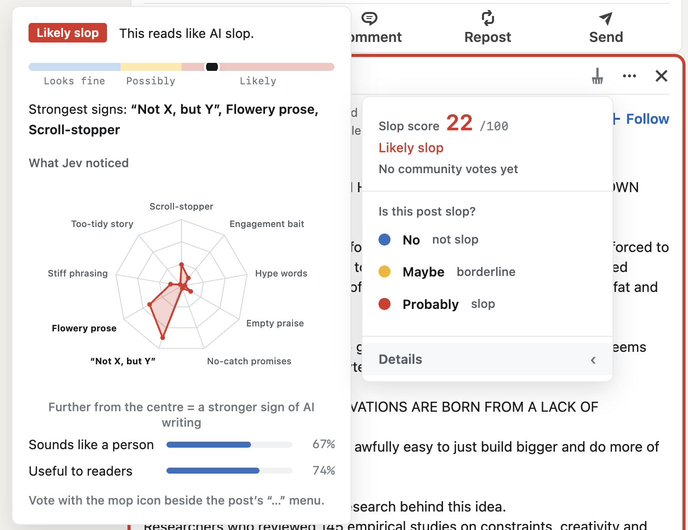

# Slop Mop (extension)

**Mop the slop out of your LinkedIn feed.** The Chrome (MV3) extension half of [Slop Mop](../README.md): *not an AI detector, a bad-writing detector*. MIT licensed.

It reads LinkedIn posts before they reach you, asks Jev (from Typesafe AI, via [`slopmop-server`](../slopmop-server)) to judge the writing, and then does one of two things:

- **Hide** folds suspected slop into a compact strip. Click it, or press *Show post*, and the post is back.
- **Highlight** leaves the post alone, outlines it yellow (possibly slop) or red (likely slop), and says why.

Either way you can inspect the score and the reasons, and vote **No**, **Maybe** or **Probably** on any post. Your vote overrules the model for you. Slop Mop never deletes, reports, mutes or blocks a post, and it never touches ads.

Less slop. More control. Your call.


## Use
- **Toolbar icon:** master on/off, **Hide / Highlight** mode, and **Mild / Moderate / Aggressive** sensitivity as a three-button group. Changes apply live, with no rescan. The popup also shows how many posts were hidden today, this week, this month and all time, and how many checks you have used today.
- **Settings page** (right-click the toolbar icon and choose *Options*, or *Settings* in the popup footer): developer options only. Debug mode and the saved-votes tools live here, so the popup stays simple.
- **First install** shows a plain-language notice about what is sent and stored. The toggle stays off until you accept it.

| Hide mode | Details for a likely post |
|---|---|
|  |  |

## What it asks Jev
Twelve questions, in parallel, for every post. Eleven judge the writing: **nine signs of slop** (from Graphite's [AI tells research](https://graphite.io/five-percent/research/ai-tells), plus a few LinkedIn habits such as scroll-stopper hooks and engagement bait) and **two counter-signs** (does it sound like one particular person, is it useful to a reader). The twelfth asks how likely a model drafted the post, and can only soften the score of writing that reads as human-typed. Hand-written slop is still slop. Useful AI-assisted writing is not slop.

## Develop
```bash
npm install
SLOPMOP_SERVER_URL=https://your-worker.example.workers.dev npm run build   # default: http://localhost:8787
npm test && npm run typecheck
```
Load `dist/` at `chrome://extensions` (Developer mode, Load unpacked).

`test/harness/` has a fake feed and popup with stubbed `chrome.*` APIs for viewing the UI in a normal tab: serve the repo root (`python3 -m http.server 8765`), build, then open `/test/harness/feed.html?mode=highlight&sens=moderate` or `/test/harness/popup.html`.

## Check a draft before you post it
LinkedIn's "Start a post" composer gets a mop button in its footer, just left of the schedule clock and the Post button. Press it and the extension sends what you have written so far to be judged, then shows the Details breakdown beside the dialog: the verdict, where it falls on the Looks fine / Possibly / Likely bar, the spider chart and the bars. A draft is scored as your own writing (on the writing alone, since nobody has reacted to it yet), so its verdict reads "Reads clean", "Possibly slop" or "Likely slop", and the panel says it is a draft and how many checks you have used today.

- **Nothing is read until you press it.** The extension doesn't look at your draft on its own.
- **It uses one of your daily checks** for each new text. Pressing it again on the same text is answered from this browser and costs nothing.
- It needs at least 20 characters, and says why when the server can't check it (for example, the daily limit).
- The panel stays until you press the button again, press Escape, click elsewhere or close the composer. The panel is promoted into the browser's top layer (an open composer is a modal), and it sits beside the dialog, not over your text, when the window is wide enough.
- **It floats inside the dialog** and is positioned beside the Post button; it is never inserted into LinkedIn's own toolbar. (An earlier version was, and when LinkedIn collapsed the toolbar for a long draft the button landed on top of the emoji button.) The Post button is found by its label (`src/content/selectors.ts`, `composer`); without it the button sits in the dialog's bottom right.

## Voting and the mop menu
Every post has a small grey mop icon just left of its "…" menu (it copies the "…" button's vertical alignment, so it stays level on posts with long headlines). It opens a dropdown, like the native one:

```
Slop score  38 /100      <- the score, and what it means (Likely slop / Possibly slop / Looks fine / Not sure)
Looks fine
-----------------------
Is this post slop?
● No     not slop
● Maybe  borderline
● Probably  slop
Clear my vote            <- once you have voted
Hide post again          <- once you have unfolded a hidden post
-----------------------
Details                  <- hover (or keyboard-focus) it: the full analysis card opens beside the menu
```
There are no chips or tabs on posts any more: the only things added to a post are the mop icon and, when there is something to show, a coloured border.

Your vote replaces the score for what is shown:
- **Highlight only mode:** the border follows your vote: blue (No), yellow (Maybe), red (Probably).
- **Hide posts mode:** **Probably** hides the post (it folds; click the strip to unfold, and it keeps a red border; "Hide post again" in the menu folds it again). **No** and **Maybe** always keep it visible, even if the score would have hidden it. Choosing your current vote again clears it.
- The icon is tinted with your vote in both modes. Votes are kept in this browser and re-applied on every load, in every tab.
- **Details** is hover-only on purpose (unlike the votes, which are clicks). The card is a tooltip that ignores the mouse, so it can never cover or block anything you want to click.
- A post that hasn't been scored yet (short, or non-English) is scored on demand when you open its menu, so the score can be shown and a vote stored with Jev's answers. If scoring fails the menu says why (for example `server 502` or a network error) and the post is retried automatically after 8s, 30s and 90s.
- Ads get no icon and are never touched.
- Votes are saved in the browser and shared with the Slop Mop server (that is what feeds the community counts and the admin dashboard). A developer-only build can also append them to a local file (see below).

## The number on the menu
The menu leads with the verdict (Likely slop, Possibly slop, Looks fine, Not sure), then a thin meter and the score out of 100. The raw score is small (a post flagged at Moderate scores about 0.22), so the shown number is stretched for display only: "possibly slop" starts at 40, the Moderate "likely slop" line is 70, and it tops out at 100 (the anchors are in the server's manifest). Nothing is decided from the shown number. Sensitivity only moves where the cutoff falls: a post shows the same number at Mild, Moderate and Aggressive, and Aggressive flags it at a lower number than Mild does. It's a score, not a probability: 70 doesn't mean "70% likely to be slop".

## Behaviour worth knowing
- **Ads are never touched.** Sponsored/promoted cards are skipped before anything is sent, hidden or outlined. Detection is any `aria-label` or text leaf containing sponsored/promoted (the real marker seen on 2026-09-18 was an svg labelled "View Sponsored Content"). It is re-checked at render time in case the marker appears late.
- **Your own posts** always get a blue/yellow/red border in either mode and are never hidden; the score and Details are in the mop menu. Author is read from `aria-label="Open control menu for post by <Name>"`; your name comes from the left-rail profile avatar and is cached. The colour keeps the usefulness half of the shield (Jev reads that from the text) but not reader response, so it reflects the writing and how useful it is, not how it was received. *Not verified against a real own post (the test account had none); tested by treating another author as "you".*
- **Debug mode (off by default, on the settings page):** the toolbar badge shows how many posts were sent to the server on this page load (resets on reload, red after a failed request); the settings page lists sent, cached, errors, detected, ads, own and skipped across your open LinkedIn tabs, plus the last error. It also adds the arithmetic ("Developer details") to the Details panel. It changes nothing about which posts get an icon or a border: short and non-English posts always get the icon, and are only scored when you open the menu or vote.

## Scrolling fast
How many posts are checked at once, and how many per minute, is set by the server and sent to the extension with every answer (`policy`); the extension only obeys it, and waits when the server says to. The queue is re-ranked as you scroll (nearest the viewport first). Posts you scroll
far past while they are still waiting are dropped without being sent, so they don't use your 250 daily checks, and they are
requested again if you scroll back. While a post's score is pending the menu shows a bouncing-dots indicator. A request that
hasn't answered after 15s is abandoned and retried.

If the server's admin disables an install, the extension stops asking, the popup says so, and it looks again once an hour.

## Tuning workflow (dev)
Thresholds are tuned on the server now: export your saved votes from the settings page (*Export JSON*) and import them into the admin dashboard's **Threshold tuner**, which scores them the way production does and suggests thresholds without applying them. The local tool below is the offline equivalent.

1. **Where votes go.** Votes are stored on the server, so tuning data normally comes from there:
   `curl -H "Authorization: Bearer $ADMIN_TOKEN" "https://<server>/api/v1/admin/export?minVotes=1" > export.ndjson`
   (`minVotes=1` while you are the only voter; the dashboard's export button uses 2), then `npm run tune -- export.ndjson`.
   *Optional, developers only:* a local file collector. Build with `npm run build:dev` (same as
   `SLOPMOP_COLLECTOR_URL=http://localhost:8788 npm run build`), run `npm run collect` in a terminal, and every vote is also
   appended to `labels/labels.jsonl` (gitignored; override with `SLOPMOP_LABELS_FILE=~/somewhere.jsonl`). A normal build has no
   collector: it never contacts localhost and requests no extra permission.
2. **Open the mop menu and hover Details** (or hover a folded strip) for the breakdown: a plain verdict ("Likely slop", "Possibly slop", "Looks fine"), where the post sits on a Looks fine / Possibly / Likely bar (blue, yellow, red; in Hide mode a line marks where posts get hidden), a spider chart of Jev's score for each tell, and three bars: how human it sounds, how useful Jev thinks it is to readers, and the reader response (reactions, comments and reposts). Jev judges usefulness from the text alone, so a well-loved post can still score low there; the reader response (measured by the server: comments and reposts count for much more than reactions, and a pile of reactions with nothing behind it is discounted) is the other half of what shields a post. The arithmetic (AI-likelihood guard, tell mean × gain, human-voice offset, shield, confidence) appears under "Developer details" only while Debug mode is on. No view ever shows the tell weights, which are private (see below).
3. **Vote No / Maybe / Probably** with the mop icon beside the post's "…" menu ("probably" = slop, "no" = not slop, "maybe" = gray zone). Vote on false positives *and* near-misses that should have been caught.
4. Every vote is saved in the browser first, then queued and sent. With the collector build, **nothing is lost if the collector isn't running**: the settings page (Saved votes) shows how many votes are waiting and a **Sync now** button (both hidden in a normal build). Each line of the file is one vote event with the post text, Jev's raw answers, engagement and what the extension decided; the last vote per post wins and a clear retracts it. The file contains post text, so keep it local.
5. `npm run tune -- labels/labels.jsonl` (an **Export JSON** file from the settings page works too) prints recall/precision at the current thresholds, a threshold sweep, suggested Aggressive/Moderate/Mild thresholds (kept ordered), the mistakes with their top tells, and where your "maybe" votes score. "Maybe" votes are left out of the accuracy numbers. Edit `THRESHOLDS`, `SLOP_GAIN` etc. in `src/shared/decide.ts` and re-run (tell weights are not edited here, see below); aim for 20+ votes with 5+ each of "no" and "probably".

## Scoring is the server's call
The server sends each verdict's `slop` and `shield`, worked out from the counts your extension reported, so the counter-tell multipliers and the reader-response model stay private and can be changed live. When a post's reactions, comments and reposts have grown about a quarter since it was checked, the extension sends the fresh counts; the server decides whether Jev is asked again (see the server README) and the old answer stays on screen until the new one arrives. Without `slop`/`shield` (answers saved by an older version, or a tuning run) `src/shared/decide.ts` does the same arithmetic itself with the public defaults.

## The manifest: no fixed values in the extension
Every fixed value (timeouts, retries, cache lifetime, how far ahead to look, the shortest post to score, where "possibly" starts, the dampener, the three thresholds, and more) comes from the server's manifest. `src/shared/manifest.ts` holds the defaults that apply until the first manifest arrives, and a test checks they match the server's. The background worker keeps the manifest for a day and fetches it again when an answer carries a `manifestVersion` it doesn't hold; every script follows changes through `chrome.storage`. A bad value is ignored, never trusted. Not in the manifest: the LinkedIn selectors (`src/content/selectors.ts`) and the colours and layout, which are the extension's own.

## Tell weights are private (server-side)
Each tell counts toward the slop score with a weight. The repo ships them all at 1×; the weights actually used are a tuning
result you keep on the server as `TELL_WEIGHTS` (see the server README). The server applies them and sends the extension
only the result (`tellMean`, and the tells ranked by contribution), so the weights are never in this repo, the extension
bundle, or any response. The Details card therefore never shows a weight.
- **Tuning against production weighting:** labels saved by this version, and the server's admin export, carry the server's composite, so `npm run tune` reproduces production scoring without knowing the weights.
- **Trying different weights:** `TELL_WEIGHTS='{"formulaicHook":0.7}' npm run tune -- labels.jsonl` recomputes the composite locally (unlisted tells count 1).

The interface follows the Slop Mop design system: Archivo and JetBrains Mono (bundled, nothing loaded from the web), one yellow accent, red for likely slop and blue for clean. Inside LinkedIn's page the custom fonts can't be loaded, so the in-page UI falls back to the system font with the same colours and spacing.

## Code layout

```
src/background/   the service worker: index.ts is a typed message router; queue.ts (nearest-first, obeys the server's policy),
                  judgeRequest.ts (one HTTP attempt -> ok/stop/rate/retry), policy.ts, verdictCache.ts, serverState.ts,
                  votes.ts, badge.ts, tabs.ts, stats.ts
src/content/      the page script: feed.ts (find/track posts), analysis.ts (ask for verdicts, scroll hints), render.ts (fold/outline),
                  voting.ts (mop icon, votes), decision.ts, state.ts; plus the UI: voteMenu, inspector (Details), fold, highlight
src/popup/        settingsPanel, statsPanel, wired together by popup.ts
src/options/      the settings page: devPanel, debugPanel, votesPanel
src/shared/tokens.css, fonts.css, base.css, palette.ts   the Slop Mop design system's tokens
src/shared/       decide.ts (pure scoring), verdict.ts (the words people see), constants.ts, types, settings, labels, ...
test/             vitest + jsdom; content-feed.test.ts drives the whole content script on a simulated feed
```

## How a post is decided
`content/` finds posts early (IntersectionObserver, ~1500px ahead) and asks the background worker, which caches raw Jev answers and calls the server. `shared/decide.ts` (pure, tested) turns raw answers into hide/yellow/red using the sensitivity threshold ("possibly" starts at part of the way to it), a dampener for posts Jev thinks a person wrote (score × 0.65 to 1, so hand-typed slop is still flagged but a marginal human post is spared), tells weighted by Jev's confidence, and a check that at least two tells stand out (one alone cuts the slop score), and a usefulness/engagement shield. Any failure leaves the post alone.

## Where it misses, and other known gaps
- **LinkedIn markup changes often.** Selectors in `src/content/selectors.ts` were verified against the live feed on 2026-09-18 (hashed classes; posts found via `role="listitem"` + `componentkey`, text via `data-testid="expandable-text-box"`). Unit tests use synthetic markup modelled on that. Re-check them first whenever posts stop being detected.
- LinkedIn scrolls inside `<main>`, so the lookahead observer roots at the nearest scroll container. LinkedIn also enforces Trusted Types, so injected UI is built with DOM APIs (`src/shared/dom.ts`), never `innerHTML`.
- **Tested on one person's feed.** It has been run as a loaded extension on a single LinkedIn account. Other layouts, languages, A/B variants and account types will find things that haven't been seen yet, and reports are the research.
- **Thresholds are provisional.** The public defaults were fitted on 27 hand votes; the live ones are set on the server and can change.
- **False positives on stiff, formal human writing** are the mistake that matters most, because a flagged human costs trust. The dampener and the vote buttons soften it; a proper labelled evaluation set is still to do.

## Server, sharing and the daily limit
The extension talks to the Slop Mop server ([`../slopmop-server`](../slopmop-server)), by default `http://localhost:8787`; build with `SLOPMOP_SERVER_URL=https://<project>.vercel.app` for a deployed one.
- **What is sent:** the post text, simple counts and engagement (never author names), and your votes (tied to a random install id). The server stores a hash of the text, Jev's scores, engagement, and vote tallies.
- **Community:** the mop menu shows how many people flagged a post as slop ("Community: 3 flagged as slop · 1 maybe · 2 no"). Your vote is saved in the browser first, then shared in the background (retried if the server is down).
- **Daily checks (250 by default; the server decides):** every new post checked uses one; the popup shows "Checks today". At the limit the extension stops asking the server until it resets (UTC midnight) and the mop menu says when. Posts it has already scored keep working from the local cache, which is keyed by the post's text so the same post in the feed, the profile carousel and "See all" is scored once.
